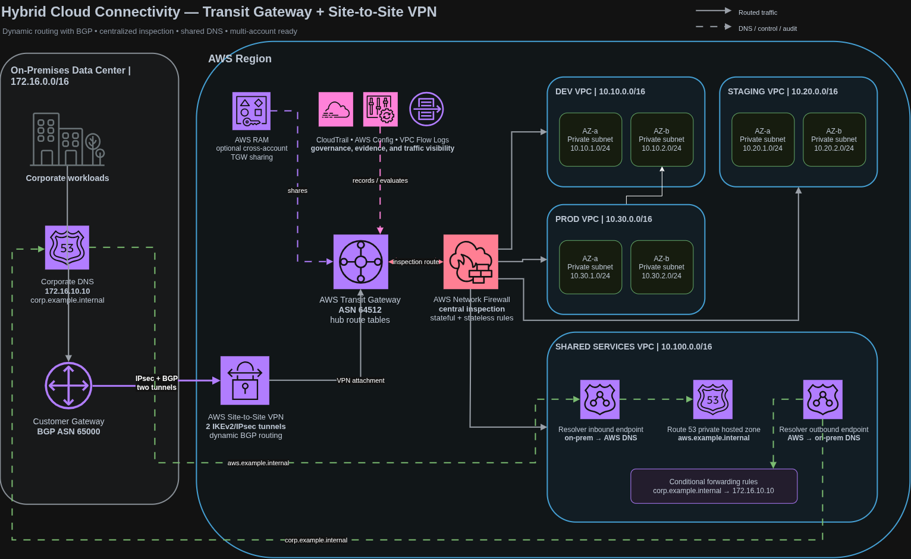

# Hybrid Cloud Connectivity with AWS Transit Gateway and Site-to-Site VPN

## Manara AWS Solutions Architect Associate — Final Project

This project presents a secure hybrid-cloud network that connects an on-premises data center to multiple isolated AWS environments. The solution uses AWS Transit Gateway as the central routing hub, a redundant Site-to-Site VPN with BGP, centralized traffic inspection with AWS Network Firewall, and bidirectional private DNS resolution through Route 53 Resolver.

The infrastructure is defined with Terraform so the complete AWS-side architecture is reproducible, reviewable, and consistent.

## Architecture



The editable diagrams.net source is available at [`docs/architecture/hybrid-cloud-connectivity-complete.drawio`](docs/architecture/hybrid-cloud-connectivity-complete.drawio).

## Project overview

The simulated organization operates an on-premises network with the CIDR `172.16.0.0/16` and is moving workloads into AWS. Development, Staging, and Production require separate VPCs, while common network services are hosted in a Shared Services VPC.

The implemented design addresses the following requirements:

- secure connectivity between the data center and AWS
- redundant VPN connectivity using two IPsec tunnels
- dynamic route exchange using BGP
- centralized connectivity for multiple VPCs
- centralized inspection of hybrid and inter-VPC traffic
- private DNS resolution between AWS and the data center
- optional Transit Gateway sharing across AWS accounts
- logging and auditing of network traffic and configuration changes

## Solution summary

AWS Transit Gateway provides the hub for four VPC attachments, the Site-to-Site VPN attachment, and the Network Firewall attachment. Default Transit Gateway association and propagation are disabled so connectivity is created explicitly through controlled route tables.

The Site-to-Site VPN uses two IKEv2/IPsec tunnels. BGP exchanges the approved AWS and on-premises prefixes and supports route reconvergence if one tunnel becomes unavailable.

AWS Network Firewall is placed in the forwarding path through separate ingress and post-inspection Transit Gateway route tables. This design ensures that hybrid and east-west traffic is inspected before reaching its destination.

The Shared Services VPC hosts Route 53 Resolver inbound and outbound endpoints. These endpoints allow the corporate network to resolve AWS private records and allow AWS workloads to resolve corporate records.

CloudTrail, AWS Config, VPC Flow Logs, VPN logs, and Network Firewall logs provide configuration history, audit events, and traffic evidence.

## Network design

### CIDR allocation

| Network | CIDR | Purpose |
| --- | --- | --- |
| On-premises data center | `172.16.0.0/16` | Corporate network advertised through BGP |
| Dev VPC | `10.10.0.0/16` | Development workloads |
| Staging VPC | `10.20.0.0/16` | Pre-production workloads |
| Prod VPC | `10.30.0.0/16` | Production workloads |
| Shared Services VPC | `10.100.0.0/16` | Route 53 Resolver and shared services |

Each VPC contains two private `/24` subnets distributed across separate Availability Zones. Public IP assignment is disabled on these subnets.

Terraform derives the following subnet ranges:

| VPC | Availability Zone A | Availability Zone B |
| --- | --- | --- |
| Dev | `10.10.0.0/24` | `10.10.1.0/24` |
| Staging | `10.20.0.0/24` | `10.20.1.0/24` |
| Prod | `10.30.0.0/24` | `10.30.1.0/24` |
| Shared Services | `10.100.0.0/24` | `10.100.1.0/24` |

### Transit Gateway

The Transit Gateway uses ASN `64512` and acts as the regional routing hub. It includes attachments for:

- Dev VPC
- Staging VPC
- Prod VPC
- Shared Services VPC
- Site-to-Site VPN
- AWS Network Firewall

VPN Equal-Cost Multi-Path support is enabled. Default route-table association and propagation are disabled to prevent unintended connectivity.

### Site-to-Site VPN and BGP

The VPN connects the Transit Gateway to a customer gateway representing the on-premises router.

| Setting | Value |
| --- | --- |
| Customer gateway ASN | `65000` |
| Transit Gateway ASN | `64512` |
| VPN type | Route-based Site-to-Site VPN |
| Tunnels | Two |
| IKE version | IKEv2 |
| Encryption | AES-256-GCM |
| Integrity | SHA-256 |
| Diffie-Hellman group | 19 |
| Routing | Dynamic BGP |
| Pre-shared key storage | AWS Secrets Manager |

The AWS VPN configuration includes tunnel and BGP logging in CloudWatch Logs. Dead-peer detection restarts an unavailable tunnel, and both tunnels are configured to start automatically.

### Centralized inspection

AWS Network Firewall inspects traffic between the data center and AWS as well as traffic between connected VPCs.

The design uses two Transit Gateway route tables:

| Route table | Associated attachments | Route behavior |
| --- | --- | --- |
| Ingress | VPC and VPN attachments | Sends connected destinations to Network Firewall |
| Post-inspection | Network Firewall attachment | Sends approved traffic to the destination VPC or VPN attachment |

The lab firewall policy permits the approved ICMP, DNS, and HTTPS traffic and drops traffic that does not match the allowlist. Firewall alert and flow logs are stored in CloudWatch Logs.

The firewall is controlled by the `enable_network_firewall` Terraform variable. When disabled, the configuration creates direct routing for a lower-cost lab mode.

## Traffic flows

### On premises to AWS

1. The customer router learns AWS prefixes through BGP.
2. Traffic is encrypted through one of the IPsec tunnels.
3. The VPN attachment delivers the traffic to Transit Gateway.
4. The ingress Transit Gateway route table sends it to Network Firewall.
5. Network Firewall evaluates the traffic policy.
6. Approved traffic returns to Transit Gateway through the firewall attachment.
7. The post-inspection route table selects the destination VPC attachment.
8. The destination VPC route table delivers the traffic to the private subnet.

### AWS to on premises

1. The VPC route table selects Transit Gateway for `172.16.0.0/16`.
2. The ingress route table forwards the traffic to Network Firewall.
3. Approved traffic enters the post-inspection route table.
4. The corporate prefix, learned from VPN BGP propagation, selects the VPN attachment.
5. The VPN encrypts the traffic and sends it to the customer gateway.

### Inter-VPC traffic

Traffic between AWS environments follows the same inspection path. A shared Transit Gateway does not automatically make all VPCs trusted; the route tables create the path and Network Firewall applies the policy.

## Hybrid DNS

The project implements DNS resolution in both directions.

### On-premises resolution of AWS records

The on-premises DNS server conditionally forwards the private suffix `aws.example.internal` to the Route 53 Resolver inbound endpoint IPs. The private hosted zone is associated with all four VPCs.

A TXT record named `connectivity.aws.example.internal` is included as a validation target. Its expected value is `hybrid-dns-ready`.

### AWS resolution of corporate records

A Route 53 Resolver forwarding rule matches `corp.example.internal` and sends queries through the outbound endpoints to the corporate DNS server at `172.16.10.10`.

The Resolver security group permits TCP and UDP port 53 only from the connected network CIDRs.

## Multi-account support

AWS Resource Access Manager support is included for organizations that place Dev, Staging, Prod, and Shared Services in separate AWS accounts.

The `ram_principal_arns` variable accepts AWS Organizations, organizational unit, or account principals. When the set is not empty, Terraform creates a Transit Gateway resource share. External principals are disabled.

## Security controls

- Private subnets do not assign public IP addresses.
- Transit Gateway default association and propagation are disabled.
- The VPN uses IKEv2 and modern encryption settings.
- Both VPN tunnels are included for redundancy.
- BGP is used for controlled dynamic route exchange.
- VPN pre-shared keys are generated by AWS and stored in Secrets Manager.
- Resolver access is limited to TCP and UDP port 53 from connected CIDRs.
- Network Firewall provides centralized stateful and stateless inspection.
- The audit S3 bucket blocks public access and denies unencrypted transport.
- Audit data is encrypted, versioned, and managed by a lifecycle policy.
- Terraform state, VPN secrets, and protected router configuration are excluded from the repository.

## Logging and audit

| Service | Evidence provided |
| --- | --- |
| AWS CloudTrail | API calls and network configuration changes |
| AWS Config | Resource configuration history and compliance state |
| VPC Flow Logs | Accepted and rejected flow metadata for every VPC |
| VPN and BGP logs | Tunnel negotiation, tunnel status, and BGP events |
| Network Firewall flow logs | Traffic processed by the firewall |
| Network Firewall alert logs | Traffic rejected or alerted by firewall rules |
| Amazon S3 | Central storage for CloudTrail and AWS Config data |

CloudTrail is configured as a multi-Region trail with log-file validation. AWS Config records supported resources and includes a managed rule that checks whether VPC Flow Logs are enabled.

## AWS services implemented

- Amazon VPC
- AWS Transit Gateway
- AWS Site-to-Site VPN
- AWS Network Firewall
- Route 53 Resolver
- Route 53 private hosted zone
- AWS Resource Access Manager
- AWS Secrets Manager
- AWS CloudTrail
- AWS Config
- VPC Flow Logs
- Amazon CloudWatch Logs
- Amazon S3

## Infrastructure as Code

Terraform `1.8.0` or later and AWS provider `~> 6.0` are used. The configuration is divided by responsibility:

| File | Responsibility |
| --- | --- |
| `network.tf` | VPCs, subnets, Transit Gateway, attachments, and routing |
| `vpn.tf` | Customer gateway, VPN tunnels, BGP, and VPN logging |
| `firewall.tf` | Network Firewall policy, attachment, and logging |
| `dns.tf` | Resolver endpoints, forwarding rules, and private hosted zone |
| `ram.tf` | Optional cross-account Transit Gateway sharing |
| `observability.tf` | VPC Flow Logs and supporting IAM resources |
| `audit.tf` | CloudTrail, AWS Config, and the audit S3 bucket |
| `variables.tf` | Configurable project inputs and validation |
| `outputs.tf` | Deployment IDs, tunnel data, DNS endpoints, and audit outputs |

## Repository structure

```text
.
├── README.md
├── Makefile
├── docs
│   ├── architecture
│   │   ├── hybrid-cloud-connectivity-complete.drawio
│   │   ├── hybrid-cloud-connectivity-complete.drawio.png
│   │   ├── hybrid-cloud-connectivity.drawio
│   │   └── hybrid-cloud-connectivity.mmd
│   ├── design.md
│   ├── direct-connect-vs-vpn.md
│   └── runbook.md
├── scripts
│   └── check.sh
└── terraform
    ├── audit.tf
    ├── dns.tf
    ├── firewall.tf
    ├── locals.tf
    ├── network.tf
    ├── observability.tf
    ├── outputs.tf
    ├── ram.tf
    ├── terraform.tfvars.example
    ├── variables.tf
    ├── versions.tf
    └── vpn.tf
```

Supporting documentation:

- [`docs/design.md`](docs/design.md) contains the detailed route-table and DNS design.
- [`docs/runbook.md`](docs/runbook.md) contains the deployment and validation procedure.
- [`docs/direct-connect-vs-vpn.md`](docs/direct-connect-vs-vpn.md) contains the connectivity comparison.

## Deployment workflow

The repository supports the following Terraform workflow:

```bash
cp terraform/terraform.tfvars.example terraform/terraform.tfvars
terraform -chdir=terraform init
terraform -chdir=terraform fmt -check -recursive
terraform -chdir=terraform validate
terraform -chdir=terraform plan -out=hybrid.tfplan
terraform -chdir=terraform apply hybrid.tfplan
```

The default customer gateway address is the documentation-only IP `203.0.113.10`. A deployment requires a real static public IPv4 address and a BGP-capable customer gateway.

After AWS resource creation, the customer router requires both AWS tunnel definitions, BGP neighbors, and Secrets Manager pre-shared keys. Corporate DNS also requires a conditional forwarder for `aws.example.internal` to the Resolver inbound endpoint addresses.

## Validation plan

| Validation | Expected evidence |
| --- | --- |
| VPN redundancy | Both IPsec tunnels and BGP sessions are established |
| Route exchange | AWS and customer route tables contain only expected prefixes |
| Hybrid reachability | Approved traffic crosses the VPN and appears in Flow Logs |
| Central inspection | Approved traffic passes and an unapproved port creates a firewall alert |
| AWS-to-corporate DNS | `corp.example.internal` records resolve through the outbound endpoint |
| Corporate-to-AWS DNS | `connectivity.aws.example.internal` returns `hybrid-dns-ready` |
| Tunnel failover | Traffic reconverges after one tunnel is disabled |
| Configuration audit | A test route change appears in CloudTrail and AWS Config |
| Cross-account sharing | The Transit Gateway appears only in the approved RAM recipient account |

The complete test procedure and troubleshooting sequence are documented in [`docs/runbook.md`](docs/runbook.md).

## Site-to-Site VPN versus Direct Connect

| Decision area | Site-to-Site VPN | AWS Direct Connect |
| --- | --- | --- |
| Path | Encrypted tunnels over the public internet | Dedicated connection to the AWS network |
| Provisioning | Fast after router readiness | Requires provider and physical or hosted connection coordination |
| Encryption | IPsec encryption is built in | Not encrypted by default |
| Performance | Internet latency and throughput can vary | More predictable latency and throughput |
| Cost | Lower entry cost | Higher port, provider, and circuit costs |
| Suitable workloads | Labs, branches, rapid deployment, backup, moderate traffic | High-volume, latency-sensitive, or enterprise connectivity |

Site-to-Site VPN was selected for this project because it can be provisioned entirely through AWS and a compatible customer gateway without a physical circuit. Direct Connect is the stronger option when predictable high-volume connectivity justifies its provisioning time and cost.

A production architecture may use Direct Connect as the primary path and retain Site-to-Site VPN as an independent backup. The detailed comparison and migration path are documented in [`docs/direct-connect-vs-vpn.md`](docs/direct-connect-vs-vpn.md).

## Cost considerations

This architecture is not covered entirely by the AWS Free Tier. The main cost sources are:

- Transit Gateway attachments and data processing
- Site-to-Site VPN hourly charges
- Route 53 Resolver endpoint ENIs
- Network Firewall endpoints and data processing
- CloudWatch Logs ingestion and retention
- AWS Config recording
- CloudTrail and S3 storage

The project includes an optional direct-routing mode that disables Network Firewall for a lower-cost routing lab. That mode does not demonstrate centralized inspection.

## Project deliverables

| Deliverable | Location | Status |
| --- | --- | --- |
| Architecture diagram | `docs/architecture/hybrid-cloud-connectivity-complete.drawio.png` | Complete |
| Editable diagram | `docs/architecture/hybrid-cloud-connectivity-complete.drawio` | Complete |
| Terraform implementation | `terraform/` | Complete |
| Design documentation | `docs/design.md` | Complete |
| Deployment and validation runbook | `docs/runbook.md` | Complete |
| VPN and Direct Connect comparison | `docs/direct-connect-vs-vpn.md` | Complete |
| Repository documentation | `README.md` | Complete |
| Live AWS deployment evidence | Requires AWS credentials and a real customer gateway | Not included |
| Optional demonstration video | Optional course deliverable | Not included |

## Learning outcomes

This project demonstrates the following AWS Solutions Architect Associate competencies:

- designing a multi-VPC hub-and-spoke architecture with Transit Gateway
- configuring dynamic hybrid routing with BGP
- designing redundant Site-to-Site VPN connectivity
- controlling attachment reachability with Transit Gateway route tables
- centralizing hybrid and east-west inspection with Network Firewall
- implementing bidirectional hybrid DNS with Route 53 Resolver
- sharing network infrastructure across accounts with AWS RAM
- comparing VPN and Direct Connect for cost, performance, and reliability
- auditing network activity with CloudTrail, AWS Config, and Flow Logs
- expressing an AWS network architecture as reusable Terraform code

## Current implementation status

The repository contains the complete AWS-side design, Terraform configuration, diagram, documentation, and validation plan. A live end-to-end hybrid connection was not established from this workstation because the deployment requires AWS credentials and a real public customer gateway.

Accordingly, the project does not claim live VPN, BGP, DNS, or failover results. The included validation matrix defines the evidence to collect during deployment.

## References

- [AWS Transit Gateway documentation](https://docs.aws.amazon.com/vpc/latest/tgw/)
- [AWS Site-to-Site VPN documentation](https://docs.aws.amazon.com/vpn/latest/s2svpn/)
- [AWS Site-to-Site VPN routing options](https://docs.aws.amazon.com/vpn/latest/s2svpn/VPNRoutingTypes.html)
- [Route 53 Resolver documentation](https://docs.aws.amazon.com/Route53/latest/DeveloperGuide/resolver.html)
- [AWS Network Firewall documentation](https://docs.aws.amazon.com/network-firewall/latest/developerguide/)
- [AWS Resource Access Manager documentation](https://docs.aws.amazon.com/ram/latest/userguide/)
- [AWS Direct Connect resiliency recommendations](https://docs.aws.amazon.com/directconnect/latest/UserGuide/resiliency_toolkit.html)
- [AWS Well-Architected Framework](https://docs.aws.amazon.com/wellarchitected/latest/framework/welcome.html)
